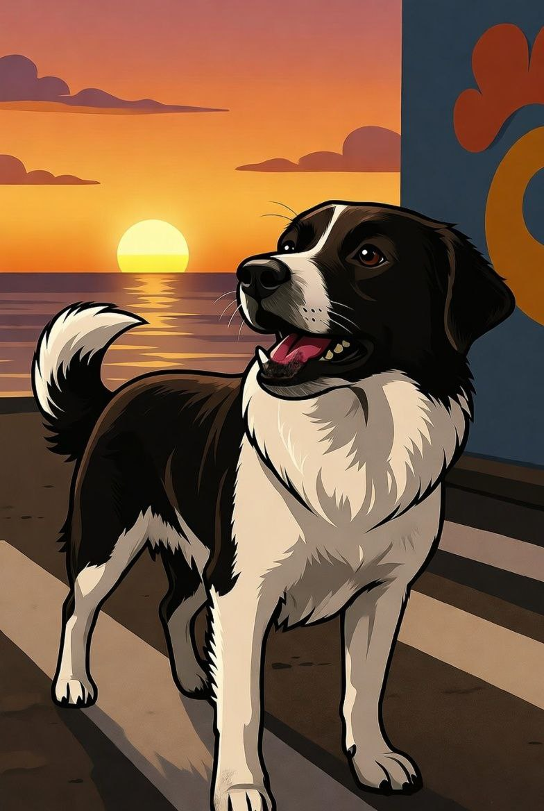

# 🐾 Kupata Coin ($KUPA)

Kupata Coin is a meme-powered, charity-driven crypto project inspired by Kupata—the legendary stray dog from Batumi, Georgia, who became famous for guiding pedestrians across busy streets. This repository contains the complete frontend code for the Kupata Coin launch site, built with React, TypeScript, and Vite.

<div align="center">
  
  <p><em>Every wag tells a story. Every transaction funds a rescue.</em></p>
</div>

## ✨ Why Kupata Coin?

-   **Real impact** – A fixed 2% transaction fee funds rescues, liquidity, and holder rewards.
-   **Meme momentum** – Viral campaigns, NFT drops, and governance mechanics keep the community energized.
-   **Charity first** – Verified NGO partnerships, audited smart contracts, and transparent reporting drive trust.
-   **Cross-chain roadmap** – Ethereum today, Solana/Base/Polygon tomorrow.

## 🚀 Live Preview

-   **Website**: Coming soon
-   **Buy $KUPA**: [Kupata on four.meme](https://four.meme/token/0x081ce7210c247cea1a19227db008173f87744444?code=U94UF59B74X7)
-   **Community Hub**: [@KupataCoin on X](https://x.com/KupataCoin)

## 🧱 Tech Stack

-   **Frontend**: React + TypeScript + Vite
-   **Styling**: Tailwind CSS + custom gradients
-   **Animation**: Framer Motion
-   **3D/Visual**: Three.js (@react-three/fiber) for ambient scenes
-   **Web3**: wagmi + Web3Modal (provider scaffolding in place)

## 📦 Getting Started

```bash
# Install dependencies
npm install

# Start the development server (http://localhost:5174 by default)
npm run dev

# Build for production
npm run build

# Preview the production build
npm run preview
```

## 📚 Project Structure

```
PEACE-main/
├─ public/
│  └─ assets/        # Static images & icons
├─ src/
│  ├─ components/    # Reusable UI sections (Hero, Tokenomics, Roadmap, etc.)
│  ├─ pages/          # Route-level views (Home, About, Utilities)
│  ├─ providers/      # wagmi / Web3 modal setup
│  └─ assets/         # Local images (Kupata hero image)
├─ README.md
└─ package.json
```

## 🪙 Tokenomics Snapshot

| Allocation           | Percentage | Amount ($KUPA) | Vesting/Lock  | Purpose                             |
| -------------------- | ---------- | -------------- | ------------- | ----------------------------------- |
| Community & Airdrops | 50%        | 500,000,000    | Linear 12mo   | Grassroots growth incentives        |
| Staking Rewards      | 20%        | 200,000,000    | Released 24mo | APY boosters & PawStake multipliers |
| Liquidity Pool & CEX | 15%        | 150,000,000    | 5-year lock   | Deep liquidity, future listings     |
| Charity Treasury     | 10%        | 100,000,000    | Controlled MS | Stray rescue funding, emergency aid |
| Team & Advisors      | 5%         | 50,000,000     | Cliff + vest  | Ops, partnerships, marketing        |

## 🔐 Safeguards

-   ✅ **Renounced contract** – no owner-only backdoors
-   ✅ **5-year LP lock** – no rug pulls
-   ✅ **3rd-party audit** – PeckShield scheduled pre-launch
-   ✅ **Multi-sig treasury** – 5/7 community signers
-   ✅ **Quarterly impact reports** – transparent charity flow

## 🌐 Social Links

-   Telegram: [t.me/shahidur8381](https://t.me/shahidur8381)
-   TikTok: [@shahidur8381](https://www.tiktok.com/@shahidur8381)
-   X (Twitter): [x.com/shahidur8381](https://x.com/shahidur8381)
-   Instagram: [instagram.com/shahidur8381](https://www.instagram.com/shahidur8381)
-   Reddit: [reddit.com/u/shahidur8381](https://www.reddit.com/user/shahidur8381)

## 🛣️ Roadmap Highlights

1. **Q4 2025** – Fair launch, PeckShield audit, smart contract renounced
2. **Q1 2026** – PawStake APYs live, charity voting via Kupata DAO, cross-chain bridge R&D
3. **Q2 2026** – Kupata Guardians NFT drop, merch store, Solana/Base bridge launch
4. **Beyond** – Global charity partnerships, IRL rescue missions, CEX listings

## 🤝 Contributing

We welcome PRs, ideas, memes, and good vibes. Make sure your code is formatted and linted before submitting.

```bash
npm run lint
```

## 📄 License

This project is [MIT Licensed](LICENSE) — feel free to remix with attribution. Let’s make the world kinder, one meme at a time.
